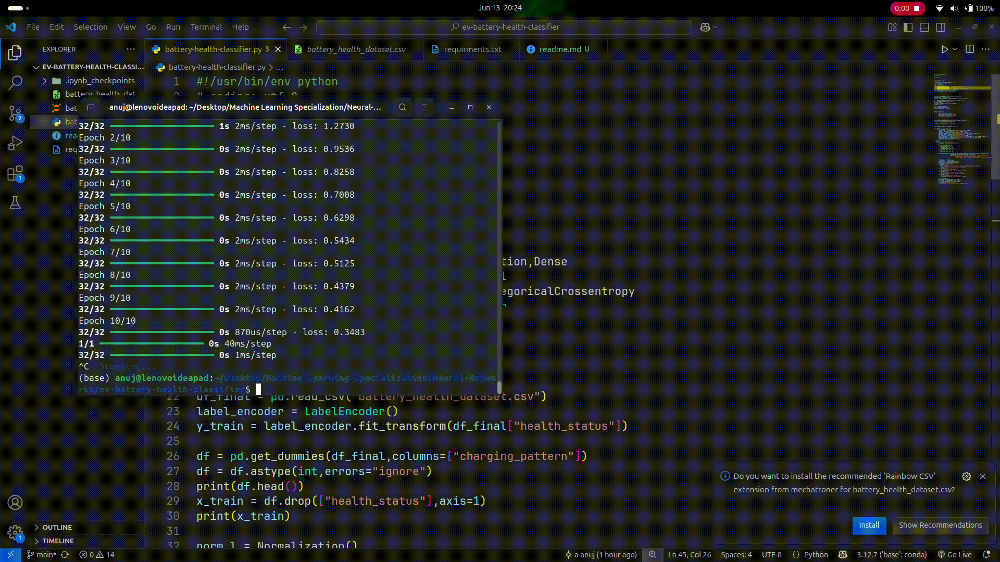

# 🔋 Battery Health Prediction App

A Streamlit web app that predicts the **health status of an EV battery** using a neural network. Users can input battery parameters like charge cycles, voltage, temperature, etc., and get real-time insights into battery health.


## 🚀 Features

- Multi-class classification using a custom-built neural network (TensorFlow)
- Intuitive Streamlit UI with form-based inputs
- Predicts **battery health status**: Good, Moderate, or Poor
- Charging pattern analysis (Fast, Slow, Overnight)
- Displays model accuracy
- Visual explanation of battery parameters (optional)


## 🌍 Real-World Use Case

Electric vehicle (EV) batteries degrade over time due to various factors like overcharging, temperature, or aging. Predicting battery health early helps:

- 🛡️ **Prevent breakdowns** by alerting users before performance drops
- 💰 **Extend battery life** by identifying harmful charging behaviors
- ⚙️ **Optimize maintenance** for fleet owners (e.g., Ola, Uber, Rapido)
- ♻️ **Enable second-life usage** for used batteries in energy storage


## ❗ Why This Is Needed

Battery replacements are **super expensive** — up to 40% of the EV cost. With real-time battery health prediction:

- Users get **actionable insights**
- Companies can **cut warranty frauds**
- Startups can offer **smart charging solutions**
- Governments can use it for **EV safety regulations**


## 📊 Input Parameters

- `charge_cycles` – Total number of charge cycles
- `voltage` – Current voltage of the battery
- `temperature` – Operating temperature (°C)
- `internal_resistance` – Internal resistance (Ohms)
- `discharge_rate` – Rate at which battery is discharged (C-rate)
- `age_months` – Age of the battery in months
- `capacity_percent` – Remaining capacity in percentage
- `charging_pattern` – Categorical: Fast / Slow / Overnight


## 🧠 Model

- Built using **TensorFlow + Keras**
- Normalized input features
- Multi-class output (0, 1, 2) representing battery health
- Accuracy: ~89.2%

## Demo



## 📦 Installation

Clone the repo:
```bash
git clone https://github.com/a-anuj/battery-health-classifier.git
cd battery-health-classifier
```
Install Dependencies:
```bash
pip install -r requirements.txt
```

Run Locally:
```bash
streamlit run battery-health-classifier.py
```